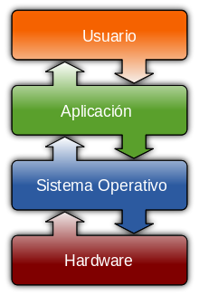

# Diccionario The Egg
## Alan Turing
*(Londres, 23 de junio de 1912-Wilmslow, Cheshire, 7 de junio de 1954)*

Uno de los padres de la ciencia de la computación.
En el ámbito de IA es conocido el test de Turing,
un criterio para juzgar si la inteligencia de la máquina
es inditinguible de un ser humano.

## Programación
Creación de programas informáticos para que el ordenador lon interprete y ejecute las instrucciones.
## Inteligencia artificial
Programa diseñado para realizar operaciones que se consideran propias de la inteligencia humana.
## Transistor
Dispositivo electrónico semiconductor utilizado para entregar una señal de salida en respuesta
a una señal de entrada. Se encuentra en todos los aparatos electrónicos que usamos diariamente.
## Ley de moore
Ley empírica que expresa que cada dos años se duplica el número de transistores en un microprocesador.
## Puertas lógicas
Dispositivo electrónico con una función booleana/sumar/restar, incluyen o excluyen según sus propiedades lógicas.
Circuitos de conmutación integrados en un chip.
## Periférico
Aparatos auxiliares conectadosa la unidad central de procesamiento (CPU) de un ordenador, a través de los
cuales el ordenador se comunica con el exterior.
* **Entradas:** Teclado, ratón, micrófono, cámara digital ...
* **Salidas:** Monitor, impresora, altavoz ...
* **Almacenamiento:** Disco duro, estado solido
* **Comunicación:** Tarjetas de red, módems, enrutadores ...

## Arquitectura von neumann

Arquitectura de diseño para un ordenador digital electrónico que consta de diferentes partes:
* Unidad de procesamiento
* Unidad aritmético lógica
* Registros del procesador
    * Unidad de control
    * Contador de programa
 * Memoria
 * Almacenamiento masivo
 * Mecanismos de entradas y salidas
 
## Arquitectura harvard
Arquitectura de computadora con pistas de almacenamiento y de señal fisicamente separadas
para las instrucciones y para los datos. Basada en relés que almacenaba las instrucciones sobre cintas
perforadas y los datos en interruptores electromecánicos.
## Sistema Operativo (SO)
Software principalde un sistema informático que gestiona los recursos hardware y provee servicios a los programas
de aplicación de software.

## Software
Soporte lógico de un sistema informático. Comprende el conjunto de los componentes lógicos para la realización
de tareas específicas.
### Compilador
Proceso que traduce un lenguaje de programación al lenguaje de máquina
### Interprete
Programa informático capaz de analizar y ejecutar otros programas.
### Editor de código fuente
Editor de texto diseñado para editar código fuente de programas informáticos.
* Aplicación individual
* Entorno de desarrollo integrado (IDE en siglas en inglés) Pycharm, Visual Studio Code, ...

### Lenguaje de programación
Lenguaje para escribir una serie de instrucciones en forma de algoritmos para controlar el comportamiento
de un ordenador.

#### Lenguaje de máquina
Sistema de código interpretable directamente por un circuito programable. Trabajan con dos únicos niveles de tensión 0 y 1.
Esto permite teoría del sistema binario en el diseño de este tipo de circuitos y en su progamación.

#### Lenguaje de alto nivel
Lenguajes de programación donde los algoritmos se expresan de una manera adecuada a la capacidad cognitiva humana.
Permite un camino bidireccional entre lenguaje máquina y una expresión casi oral entre la escritura del programa y
su posterior compilación.

* **Python:** Lenguaje de programación de alto nivel y multipropósito que actualmente tiene muchos usuarios y
se utiliza mucho para IA
* **R:** Lenguaje de programación de alto nivel que se usa mucho para temas de estadística
* **Lisp:** Familia de lenguajes de programación de computadora de tipo multiparadigma con larga
historia.
* **Java:**
* **DESARROLLO WEB** 
    * **javascript:** Lenguaje de programación de alto nivel que se usa para dar vida a las páginas web
    * **php:** Lenguaje de programación de uso general. Especialemnte para desarrollo web,
    * **html:** Lenguaje de programación para crear estructura y contenido para páginas web
    * **CSS:** Lenguaje de programación para la estética de las páginas web.
* **SQL:** Lenguaje de programación para trabajar con bases de datos.
## Hardware
* **Raspberry pi:** Ordenador de placa reducida de bajo costo.
* **Arduino:** Placa electrónica de bajo coste para acercar el uso de la electrónica y programación.

## Repositorio de control de versiones
Almacenamiento y gestión del código en la nube
* **Github**
Plataforma de control de versiones git. Microsoft compró en 2018
* **Gitlab**
Servicio web de control de versiones basado en git

