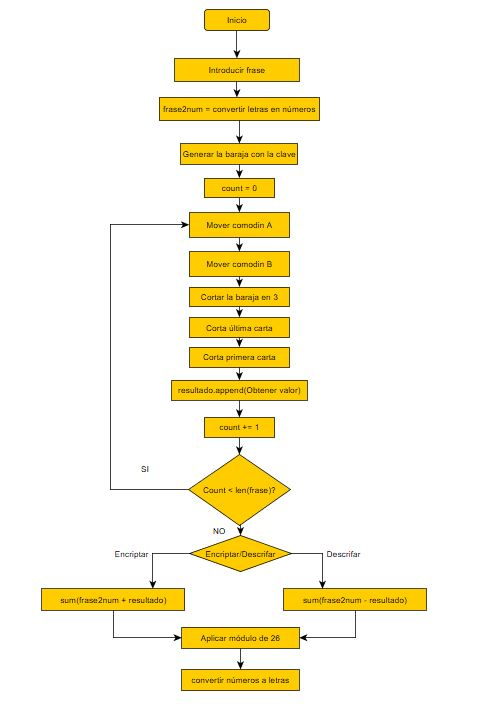
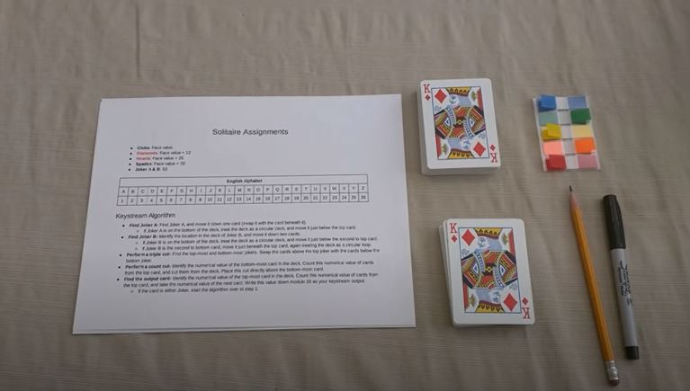

# Tarea 23 - Algoritmo Solitario

## Para ejecutar el programa
* Python3.x

## Construir una comunicación cifrada entre dos funciones utilizando el algoritmo del solitario:
1. Función 1: Enviar una frase para que la función lo cifre mediante el solitario. 
2. Función 2: Recoge el mensaje cifrado y lo descifra utilizando este mismo algoritmo.

## Ejemplo

|       sentence        | clave |       encrypt       |        decoded     | 
| :-------------------: | :---: | :-----------------: | :----------------: |
| Mi nombre es Imanol   | kaixo |   ngqptgynnfiibckw  |  minombreesimanol  |
| Egun on               | covid |   wbpdpr            |    egunon      |

        

## Diagrama de flujo

Para entender bien el algoritmo he seguido este video.

 

http://jnicholl.org/Cryptanalysis/Ciphers/Solitaire.php

