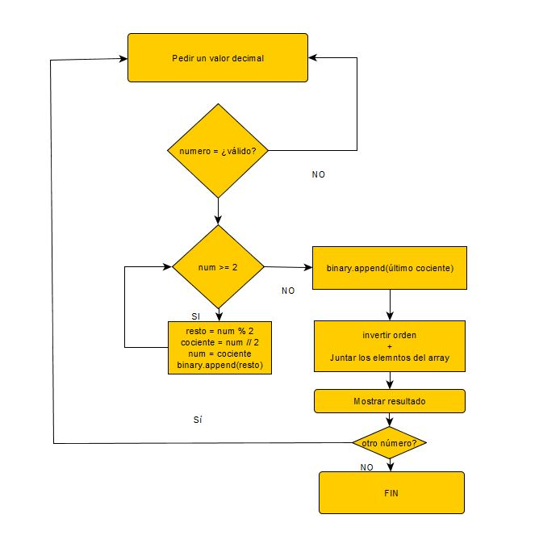

# Tarea 24

# Para ejecutar el programa
* Python3.x

## Lógica del programa
1. Pedir un valor decimal
2. Chequear si el valor es válido. Si no pedir otra vez.
3. Convierta a binario 
4. Devolver resultado

