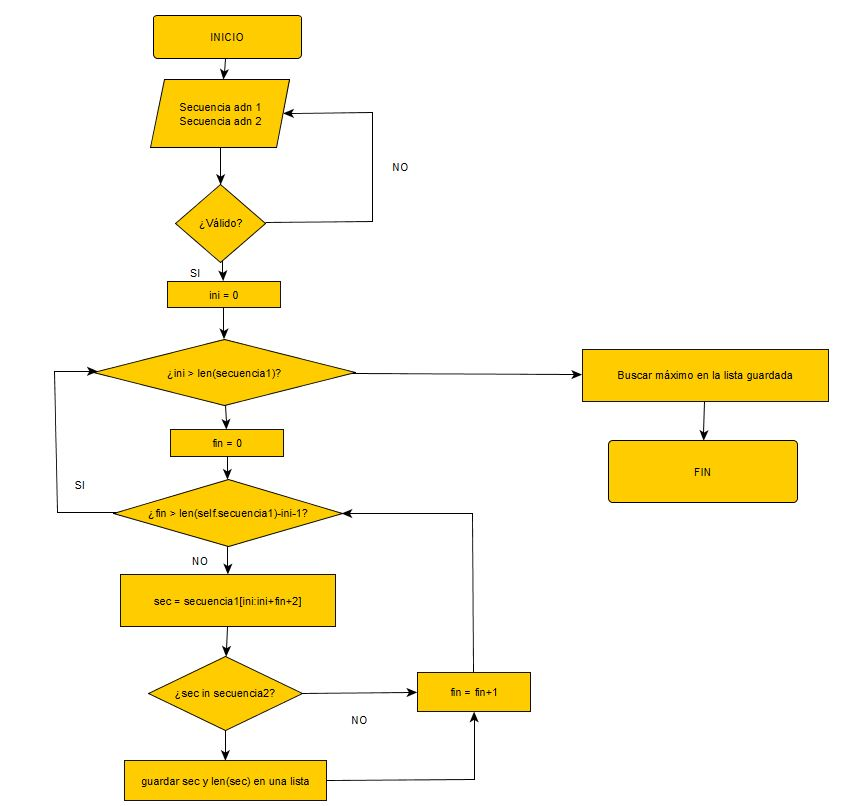

# Tarea 38
## El biólogo
>Eres un biólogo que examina secuencias de ADN de formas de vida diferentes. Se te darán dos secuencias de ADN,
y el objetivo es encontrar el conjunto ordenado de bases adyacentes de mayor tamaño que es común en ambos ADNs.
Las secuencias de ADN se darán como conjuntos ordenados de bases de nucleótidos: adenina (abreviado A), citosina (C),
guanina (G) y timina (T):

>ATGTCTTCCTCGA TGCTTCCTATGAC
Para el ejemplo anterior, el resultado es CTTCCT porque que es el conjunto ordenado de bases adyacentes de mayor tamaño
 que se encuentra en ambas formas de vida.
### Ejemplos de entradas y salidas
* **Entrada:** ctgactga actgagc         **Salida:** actga
* **Entrada:** cgtaattgcgat cgtacagtagc **Salida:**  cgta
* **Entrada:** ctgggccttgaggaaaactg gtaccagtactgatagt **Salida:** actg

## Invertir palabras

## Palíndromos
