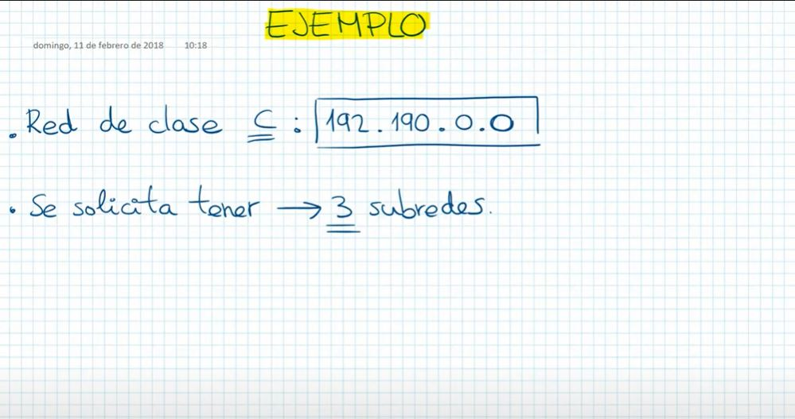

# Tarea 39 - Simulador de Redes

Para realizar la tarea debes utilizar Packet Tracer de Cisco:
1. Instalar el software en tu ordenador.
2. Empezar a entender cómo trabajar con este software y a profundizar en conceptos adquiridos en
anteriores tareas.
3. Montar en el simulador las siguientes redes (añadimos links con la resolución):
    3.1. Red con servidor web y servidor de DNS
    3.2. Red con servidor DHCP
    3.3. Red VLAN básica
    3.4. Unir dos redes VLAN con un router
    3.5. Enrutamiento estático

## Clases de Direcciones IPV4

| Clases | Redes            | Red     | Host    | primer octeto | Máscara      | 
| ----| ------------------- |---------|---------|---------------|--------------|
| A   | interntet grandes   | 8 bits  | 24 bits | 0 - 127       |255.0.0.0     |
| B   | interntet moderadas | 16 bits | 16 bits | 128 - 191     |255.255.0.0   |
| C   | interntet pequeñas  | 24 bits | 8 bits  | 192 - 223     |255.255.255.0 |
| D   | multicast           |         |         | 224 - 239     |              |
| E   | experimentales      |         |         | 240 - 255     |              |

subred: division de red más grande
Crear subred: bits de host asignar a la porción de red

con 4 bits prestados de la porción de host --> 2^4 = 16 subredes --> máscara: 255.240.0.0
con 3 bits prestados de la porción de host --> 2^3 = 8 subredes --> máscara: 255.255.255.224

Red: 192.168.168.0
Subredes
* 192.168.168.0
* 192.168.168.32
* 192.168.168.64
* 192.168.168.96
* 192.168.168.128
* 192.168.168.160
* 192.168.168.192
* 192.168.168.224
