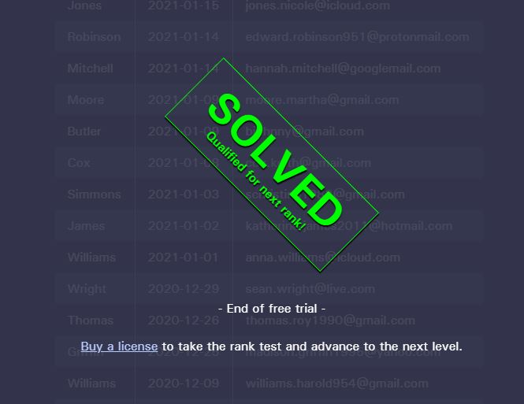

# Jugando con SQL

Escribe en un documento de texto (.doc, .txt, ...) la sentencia SQL que has utilizado para cada caso resuelto junto con 
una breve explicación sobre la sentencia SQL que has utilizado.

## Submit all details from table
#### SELECT * FROM table;
SELECT * FROM subscribers;
El * selecciona todas las columnas de la tabla.

## Submit some details from table;
#### SELECT columns FROM table;
SELECT EmailAddress, Surname FROM mailing_list;

## No duplicates
#### SELECT DISTINCT columns FROM table;
SELECT DISTINCT NumberOfDownloads FROM users;

## Order by column in ascending order
#### SELECT columns FROM table ORDER BY column ASC;
SELECT * FROM subscribers ORDER BY Address ASC;

## Order by column in descending order
#### SELECT columns FROM table ORDER BY column DESC;
SELECT * FROM members ORDER BY JoinedOn ASC;

## Order by two columns descending
#### SELECT * FROM table ORDER BY column1 DESC, column2 DESC;
SELECT Username, PassowrdHas FROM members ORDER BY Username DESC, PasswordHash DESC;

## Order and Limit rows
#### SELECT * FROM table ORDER BY column ASC LIMIT 5;
SELECT * FROM subscribers ORDER BY Purchases ASC, Username DESC LIMIT 5;

