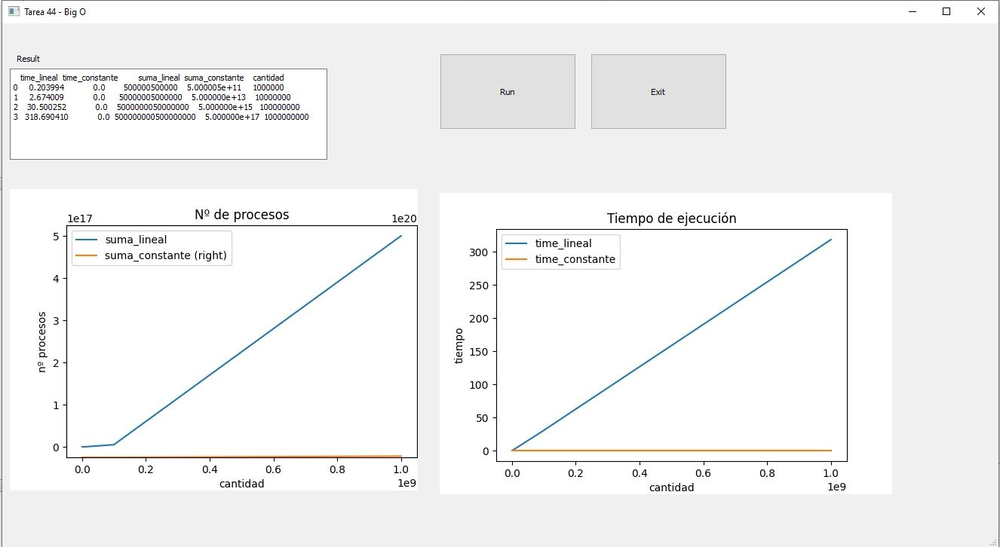

**Análisis del rendimiento de las aplicaciones de IA**

El rendimiento de la aplicación es un factor clave y varia según aumenta el volumen de datos que
gestionan. Al tratar de caracterizar la eficiencia de un algoritmo en términos del tiempo de ejecución,
independientemente de cualquier programa o computadora, es importante cuantificar el número de
operaciones o pasos que necesitará el algoritmo para cumplir con su propósito. Si se considera que cada
uno de estos pasos es una unidad básica de cálculo, el tiempo de ejecución de un algoritmo puede
expresarse como el número de pasos necesarios para resolver el problema
Se ha utilizado Técnicas/metodologías O Grande (Big O Notation) para analizar el comportamiento de los algoritmos. La notación Big O lo
que trata de medir son el número de pasos.

Resultado: 

Programar el problema que se plantea en la siguiente secuencia de videos en el
lenguaje de programación que desees:

* https://www.youtube.com/watch?v=GD254Gotp-4
* https://www.youtube.com/watch?v=MaY6FpP0FEU

Requisitos:
* python 3.8
* librerías: matplotlib, pandas, PyQt5 --> pip install -r requeriments.txt
* descargar la tarea_44
* ir a la carpeta de la tarea --> cd path/to/tarea
* ejecutar el archivo **gui.py** --> python gui.py

He utilizado **Qt Creator** para crear la interfaz gráfica. Para descargar versión gratuita: https://www.qt.io/

