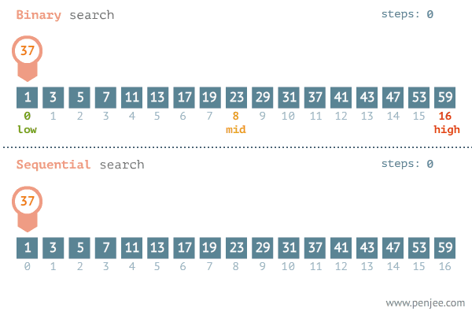
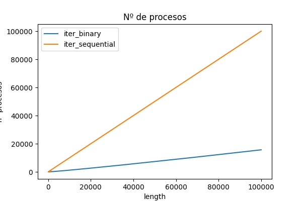

# Búsqueda secuencial y binaria

| Búsqueda| Definición| Ventajas | Desventajas | Ejemplo |
|:-------:|:---------:|:--------:|:-----------:|:-------:|
|secuencial  |El algoritmo compara uno a uno los elementos del array hasta dar con el elemento en caso del que exista.|El vector no tiene que estar ordenado| Es lento. Más iteraciones |11 iteraciones |
|Binaria|Divide el array para encontrar el elemento|Más eficiente. Menos iteraciones|Tiene que estar ordenado| 4 iteraciones

 
*ejemplo: buscar 874 en [3, 56, 21, 33, 874, 123, 66, 1000, 23, 45, 65, 56]

  

# Análisis en Notación Big O

 
 
 

 En esta gráfica podemos observar que cuando aumentamos el número de elementos en el array la búsqueda secuencial tiene una pendiente mucho más pronunciada que la búsqueda binaria. Esto es, para el mismo número de elementos la búsqueda secuencial tiene que realizar muchas más iteraciones que la búsqueda binaria.

 Para realizar este análisis he realizado 1000 iteraciones que en cada iteración añado 100 numeros a la lista y busco el número que está en la posición 3/4 del array. De esta manera me aseguro que los dos métodos de búsqueda realicen unas cuantas iteraciones.

# Referencias
- https://stackabuse.com/sorting-algorithms-in-python/
- https://realpython.com/sorting-algorithms-python/

# Resolucion del ejercicio
## Para ejecutar el programa
* Python3.8 e instalar las librerías pandas y matplotlib

Pasos a seguir:
1. Crear un entorno virtual
    Pip install virtualenvwrapper-win
    mkvirtualenv --python==path\to\python.exe envname --> C:\usuarios\xxxx\envs

2. Activar entorno virtual
    workon env

3. Instalar librerías
    cd path/to/requermients.txt
    pip install -r requeriments.txt

4. Ejecutar el código
    cd path/to/file.py
    workon env
    python file.py
