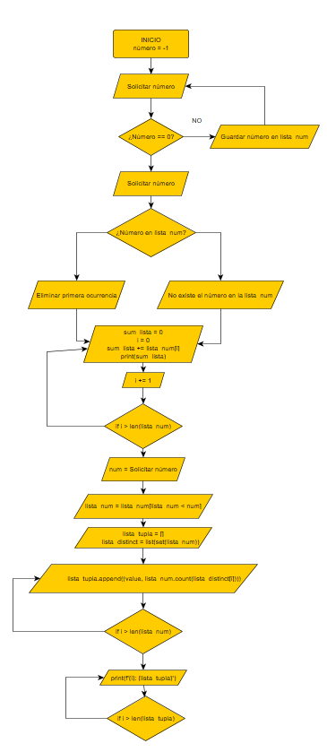
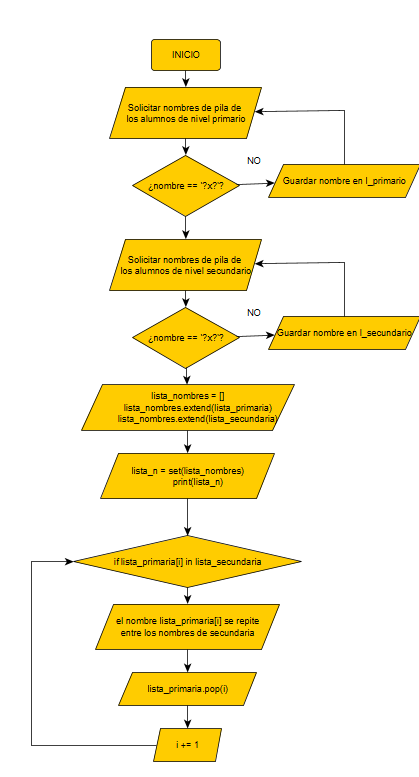

# Tarea 52

1. Desarrolla un programa que sirva para:

    - Solicitar al usuario que ingrese números, los cuales se guardarán en una lista. Finalizar al ingresar el
número 0, el cual no debe guardarse.
    - A continuación, solicitar al usuario que ingrese un número y, si el número está en la lista, eliminar su
primera ocurrencia. Mostrar un mensaje si no es posible eliminar.
    - Recorrer la lista para imprimir la sumatoria de todos los elementos.
    - Solicitar al usuario otro número y crear una lista con los elementos de la lista original que sean menores
que el número dado. Imprimir esta nueva lista, iterando por ella.
    - Generar e imprimir una nueva lista que contenga como elementos a tuplas de dos elementos, cada una
compuesta por un número de la lista original y la cantidad de veces que aparece en ella. Por ejemplo, si
la lista original es [5,16,2,5,57,5,2] la nueva lista contendrá: [(5,3), (16,1), (2,2), (57,1)]

2. Solicitar al usuario que ingrese los nombres de pila de los alumnos de nivel primario de una escuela,
finalizando al ingresar ?x?. A continuación, solicitar que ingrese los nombres de los alumnos de nivel
secundario, finalizando al ingresar ?x?.
    - Informar los nombres de todos los alumnos de nivel primario y los de nivel secundario, sin repeticiones.
    - Informar qué nombres se repiten entre los alumnos de nivel primario y secundario.
    - Informar qué nombres de nivel primario no se repiten en los de nivel secundario.

# Para ejecutar el programa
* Python3.x
* librerías utilizadas: numpy
    * pip install numpy