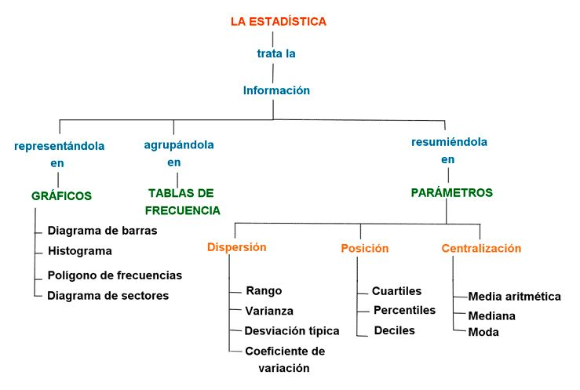
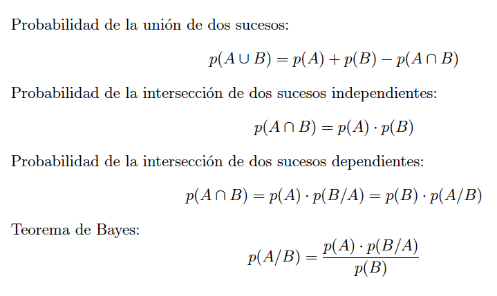

# Estadística inferencial para novatos
# Diccionario
Estadística inferencial 
variable 
muestra 
predicción 
estimación 
hipótesis 
varianza 
correlación 
p-valor 
distribución normal

Se encarga de hacer deducciones, inferir propiedades, llegar a conclusiones y describir tendencias a partir de una muestra representativa

Esta rama de la estadística emplea habitualmente diferentes técnicas para poder hacer deducciones,
como por ejemplo:
## 1.- Pruebas de estimación puntual (o de intervalos de confianza): 
El objetivo es aproximar el valor del parámetro desconocido (tiempo medio de ejecución de un algoritmo, altura media de una población,
diferencia del resultado entre dos tratamientos médicos, ...). Una estimación es puntual cuando se usa un
solo valor extraído de la muestra para estimar el parámetro desconocido de la población. A veces es
conveniente obtener unos límites entre los cuales se encuentre el parámetro con un cierto nivel de
confianza, en este caso es una estimación por intervalos.
##2.- Pruebas paramétricas y no paramétricas: 
Las paramétricas asumen distribuciones estadísticas subyacentes a los datos (como de media, de diferencia de medias, proporciones, etc.). Las no
paramétricas no deben ajustarse a ninguna distribución (como la prueba del chi-cuadrado, etc.).
##3.- Otros: 
Análisis de correlación y de regresión, las series cronológicas, el análisis de varianza, ...

##Conceptos
1. Muestra y población
2. Distribuciones de variables
3. Intervalos de confianza 
4. Distribución de densidad de probabilidad
5. Distribución normal 
6. Esencia de los modelos predictivos

##Metodología de trabajo
1. Planteamiento del problema: Fijar objetivos o algunas preguntas del tipo:
   - ¿Cuál será la media de esta población respecto a tal característica?
   - ¿Se parecen estas dos poblaciones?
   - ¿Hay alguna relación entre...?
En el planteamiento se definen con precisión la población, la característica a estudiar, las variables, etc.

2. Elaboración de un modelo: en caso de establecer un modelo teórico, se replantea el procedimiento
y se llega a una conclusión lógica. Los posibles modelos son distribuciones de probabilidad.

3. Extracción de la muestra: se usa alguna técnica de muestreo o un diseño experimental para obtener
información de una pequeña parte de la población.

4. Tratamiento de los datos: en esta fase se eliminan posibles errores, se depura la muestra, se
tabulan los datos y se calculan los valores que serán necesarios en pasos posteriores, como la media
muestral, la varianza muestral.
Los métodos de esta etapa están definidos por la estadística descriptiva.

5. Estimación de los parámetros: con determinadas técnicas se realiza una predicción sobre cuáles
podrían ser los parámetros de la población.

6. Contraste de hipótesis: los contrastes de hipótesis son técnicas que permiten simplificar el modelo
matemático bajo análisis. Frecuentemente el contraste de hipótesis recurre al uso de estadísticos
muestrales.

7. Conclusiones: se critica el modelo y se hace un balance. Las conclusiones obtenidas en este punto
pueden servir para tomar decisiones o hacer predicciones.
   
El estudio puede comenzar de nuevo a partir de este momento, en un proceso cíclico que permite
conocer cada vez mejor la población y características de estudio.
Si los elementos de la muestra no se extraen al azar, se corre el riesgo de que no resulte representativa de la 
población, es decir, de que esté sesgada

**Probabilidad** Facilidad o dificultad de que se produzca cada uno de los posibles resultados de un proceso aleatorio.
**Frecuencia relativa**: Número de veces que se ha producido un resultado dividido entre el número total de repeticiones
**Sucesos**: Posibles resultados de un proceso

La estadística inferencial trata principalmente del suceso que consiste en obtener un determinado valor de un 
estadístico en una muestra extraída al azar de una población, conociendo cierta información sobre esa población 

**distribución muestral**: La probabilidad de cada uno de los posibles valores que puede tomar un estadístico en 
muestras extraídas al azar
**función de densidad de probabilidad**: Cuando el valor del estadístico muestral es una variable continua.
**distribución normal/gaussiana**

## Referencias
http://formacion.intef.es/pluginfile.php/246706/mod_resource/content/1/ampliacin_las_matemticas_de_la_probabilidad.html 

